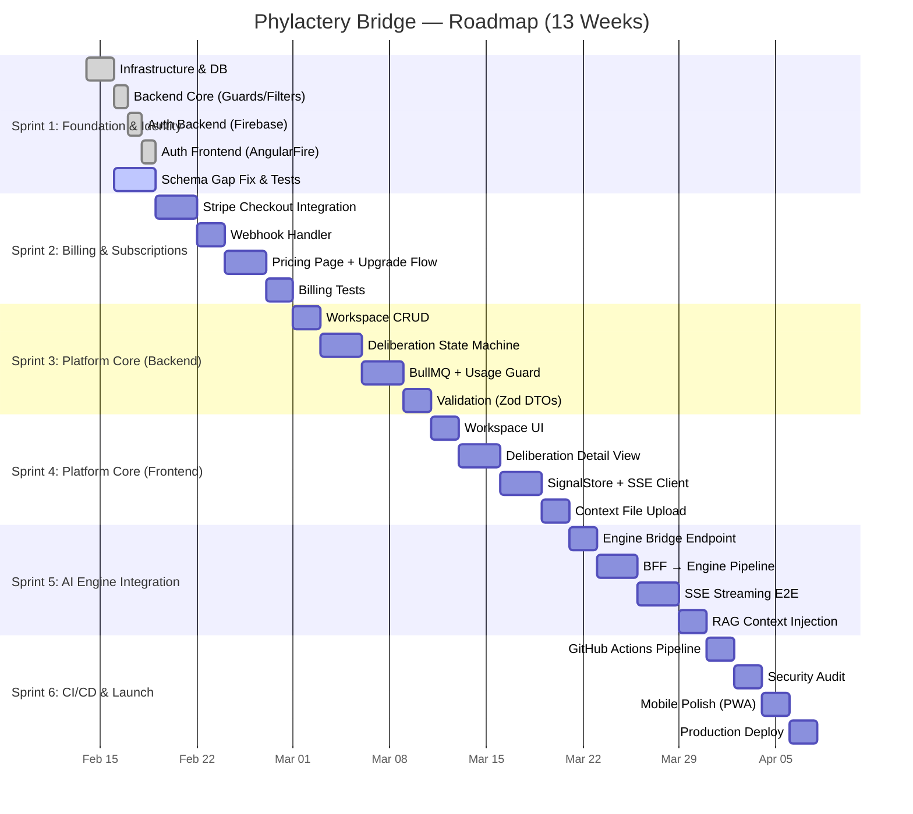

# 🦴 Phylactery Lich — Sprint 1 Audit & Entity Analysis

> **Autor**: The Lich (CTO Persona, SkullRender)
> **Fecha**: 2026-02-16
> **Scope**: Auditoría post-Sprint 1, gap analysis de entidades DDD vs. Prisma, testing strategy, y roadmap completo.

---

## 1. Veredicto Ejecutivo (CTO)

Sprint 1 entregó la **columna vertebral** del sistema. El esqueleto está en pie, pero le faltan huesos críticos antes de poder caminar. El código implementado cubre el **70% del diseño aprobado**, con 4 gaps que requieren atención inmediata.

### ✅ Lo que se hizo bien
| Componente | Status | Calidad |
|------------|--------|---------|
| NestJS Scaffold + Modules | ✅ Completo | DDD-aligned |
| Prisma Schema (6 models, 5 enums) | ✅ Completo | Relaciones correctas |
| Firebase Admin SDK Integration | ✅ Completo | Singleton pattern |
| AuthGuard + @CurrentUser | ✅ Completo | Functional guard |
| Global Exception Filter | ✅ Completo | Standardized errors |
| Logging Interceptor | ✅ Completo | Request/response audit |
| Angular 19 + Ionic + TailwindCSS | ✅ Completo | Standalone components |
| AngularFire + Auth Service (Signals) | ✅ Completo | Modern Angular |
| Routes + Guards + Interceptor | ✅ Completo | Lazy-loaded |
| Login + Dashboard (SkullRender UI) | ✅ Completo | Branded |

### ⚠️ Gaps Identificados (DDD Model vs. Implementación)

---

## 2. Entity Gap Analysis: DDD Plan vs. Prisma Schema

### 2.1 Campos Faltantes en `User`

El modelo DDD definió Value Objects que se aplanaron correctamente en Prisma, **pero** faltan estos campos:

| Campo DDD | Prisma Status | Impacto |
|-----------|---------------|---------|
| `displayName` | ❌ FALTA | Login muestra `'Architect'` en vez del nombre real |
| `avatarUrl` | ❌ FALTA | No hay foto de perfil |
| `suspensionReason` | ❌ FALTA | Admin no puede documentar por qué suspendió |
| `lastFailedAttempt` | ❌ FALTA | Security: no se puede implementar cooldown de lockout |
| `marketingEmails` | ❌ FALTA | DDD especificaba `NotificationPrefs.marketingEmails` |

### 2.2 Campos Faltantes en `Deliberation`

| Campo DDD | Prisma Status | Impacto |
|-----------|---------------|---------|
| `architectModel` | ❌ FALTA | No se persiste qué modelo se usó para cada agente |
| `auditorModel` | ❌ FALTA | Idem |

> Los definimos como `ModelSelection` (Value Object), pero el Prisma schema no los incluye en Deliberation.

### 2.3 Modelo `UsageCounter` — **No Existe**

El DDD define un **Value Object crítico** `UsageCounter` que vive en el User:

```
+int currentDeliberations
+int monthlyLimit
+int tokensUsed
+Money totalCost
+DateTime lastResetDate
+canDeliberate() → bool
```

**Esto NO está en el Prisma schema.** Sin esto, no podemos implementar:
- `UsageGuard` (Sprint 3)
- Rate limiting por plan
- Upsell trigger cuando se agotan deliberaciones

### 2.4 Resumen de Gaps

| Modelo | Campos Existentes | Campos DDD Total | Coverage |
|--------|-------------------|-------------------|----------|
| User | 14 | 19 | **74%** |
| Subscription | 9 | 9 | **100%** ✅ |
| Invoice | 7 | 7 | **100%** ✅ |
| Workspace | 5 | 5 | **100%** ✅ |
| Deliberation | 12 | 14 | **86%** |
| DeliberationStep | 8 | 8 | **100%** ✅ |
| UsageCounter | 0 | 7 | **0%** ❌ |

---

## 3. Decisiones de Producción Pendientes

Estas decisiones se plantearon en el plan pero **no fueron respondidas formalmente**:

| # | Decisión | Recomendación CTO | Status |
|---|----------|-------------------|--------|
| 1 | **¿Stripe Checkout o PaymentElement embebido?** | Checkout (redirect) — Zero PCI compliance | ⏳ Pendiente |
| 2 | **¿13 semanas es realista?** | Sí para 1 dev full-time, agresivo pero viable | ⏳ Pendiente |
| 3 | **¿Customer Portal de Stripe?** | Sí, usar el hosted portal de Stripe | ⏳ Pendiente |
| 4 | **¿Facturación CFDI?** | Post-launch, integrar con Facturapi | ⏳ Pendiente |
| 5 | **¿NGRX SignalStore o Signals puras?** | Signals para local, SignalStore para global (billing state) | Aprobado en plan |

> [!IMPORTANT]
> Necesito tu respuesta a las decisiones 1-4 antes de Sprint 2.

---

## 4. Backend Auth — Lo que Falta por Completar

El `AuthService` actual solo hace `register` (upsert). Faltan Use Cases críticos:

| Use Case | Endpoint | Status |
|----------|----------|--------|
| Register (Firebase → Prisma) | `POST /auth/register` | ✅ Implementado |
| Get Profile | `GET /auth/profile` | ❌ Falta |
| Update Settings | `PATCH /auth/settings` | ❌ Falta |
| Export Data (GDPR) | `GET /auth/export` | ❌ Falta (Sprint 6) |
| Delete Account | `DELETE /auth/account` | ❌ Falta (Sprint 6) |
| Admin: Suspend User | `POST /admin/users/:id/suspend` | ❌ Falta (Sprint 6) |
| Admin: Stats | `GET /admin/stats` | ❌ Falta (Sprint 6) |

---

## 5. Roadmap Completo — Fases y Status



### Status por Sprint

| Sprint | Nombre | Semanas | Status | Progress |
|--------|--------|---------|--------|----------|
| **1** | Foundation & Identity | 1-2 | 🟡 In Progress | **85%** (tests + schema fix pending) |
| **2** | Billing & Subscriptions | 3-4 | ⬜ Not Started | 0% |
| **3** | Platform Core (Backend) | 5-6 | ⬜ Not Started | 0% |
| **4** | Platform Core (Frontend) | 7-8 | ⬜ Not Started | 0% |
| **5** | AI Engine Integration | 9-10 | ⬜ Not Started | 0% |
| **6** | CI/CD & Launch | 11-12 | ⬜ Not Started | 0% |
| **Buffer** | Bug fixes & polish | 13 | ⬜ Not Started | 0% |

---

## 6. Testing Strategy (Jest + E2E)

> [!IMPORTANT]
> **Regla**: No se avanza a Sprint 2 sin que Sprint 1 tenga tests verdes.

### 6.1 Unit Tests (Jest)

| Target | File | Test Cases |
|--------|------|------------|
| `AuthService` | `auth.service.spec.ts` | Register new user, Return existing user, Handle invalid token |
| `FirebaseService` | `firebase.service.spec.ts` | Init with valid creds, Verify valid token, Reject expired token |
| `AuthGuard` | `auth.guard.spec.ts` | Allow valid token, Reject missing header, Reject invalid token |
| `PrismaService` | `prisma.service.spec.ts` | Connect on init, Disconnect on destroy |
| `AuthService (FE)` | `auth.service.spec.ts` | Login success, Login failure, Logout clears state |
| `AuthInterceptor (FE)` | `auth.interceptor.spec.ts` | Attach token, Pass through if no user |
| `AuthGuard (FE)` | `auth.guard.spec.ts` | Redirect to login if not auth'd, Allow if auth'd |

### 6.2 Integration Tests (Backend)

| Flow | Test Case | Assertion |
|------|-----------|-----------|
| Register Flow | POST /auth/register with valid Firebase token | 201 + User in DB |
| Register Idempotent | POST /auth/register twice same token | Same user returned |
| Unauthorized | POST /auth/register without token | 401 Unauthorized |
| Invalid Token | POST /auth/register with garbage token | 401 Unauthorized |

### 6.3 E2E Tests (Full Stack)

| Scenario | Steps | Expected |
|----------|-------|----------|
| **Happy Path** | Google Login → Register → Dashboard | User sees dashboard with name |
| **Guard Protection** | Navigate to /dashboard without auth | Redirect to /login |
| **Logout** | Login → Logout | Redirect to /login, token cleared |

### 6.4 Test Infrastructure

```
backend/
├── test/
│   ├── jest-e2e.json         ← E2E config
│   ├── app.e2e-spec.ts       ← Full app E2E
│   └── fixtures/
│       └── firebase-mock.ts  ← Mock Firebase Admin SDK
├── src/
│   ├── core/auth/
│   │   ├── auth.service.spec.ts
│   │   ├── auth.controller.spec.ts
│   │   └── firebase.service.spec.ts
│   ├── core/guards/
│   │   └── auth.guard.spec.ts
│   └── core/prisma/
│       └── prisma.service.spec.ts

frontend/
├── src/app/
│   ├── core/services/
│   │   └── auth.service.spec.ts
│   ├── core/guards/
│   │   └── auth.guard.spec.ts
│   ├── core/interceptors/
│   │   └── auth.interceptor.spec.ts
│   └── features/auth/login/
│       └── login.component.spec.ts
```

---

## 7. Prisma Schema Fix — Cambios Requeridos

Para cerrar los gaps del §2, el schema necesita estos cambios:

```diff
model User {
  id            String    @id @default(uuid())
  email         String    @unique
  firebaseUid   String    @unique
+ displayName   String?
+ avatarUrl     String?
  role          UserRole  @default(FREE)
  createdAt     DateTime  @default(now())
  updatedAt     DateTime  @updatedAt

  // Preferences
  language                String  @default("es")
  preferredArchitectModel String?
  preferredAuditorModel   String?
  emailOnComplete         Boolean @default(true)
  emailOnProductUpdate    Boolean @default(true)
+ marketingEmails         Boolean @default(false)
  allowDataTraining       Boolean @default(false)

  // Security
  failedLoginAttempts  Int      @default(0)
  isSuspended          Boolean  @default(false)
+ suspensionReason     String?
+ lastFailedAttempt    DateTime?

+ // Usage (UsageCounter VO — flattened)
+ currentDeliberations Int     @default(0)
+ monthlyLimit         Int     @default(5) // FREE tier default
+ tokensUsed           Int     @default(0)
+ totalCostCents       Int     @default(0) // in cents USD
+ usageLastResetDate   DateTime @default(now())

  // Relationships
  subscription  Subscription?
  workspaces    Workspace[]
  deliberations Deliberation[]
}

model Deliberation {
  // ... existing fields ...
+ architectModel String?
+ auditorModel   String?
}
```

---

## 8. Próximos Pasos Inmediatos (Prioridad)

| # | Acción | Blocker? | Estimado |
|---|--------|----------|----------|
| 1 | **Fix Prisma Schema** (agregar campos faltantes) | No | 15 min |
| 2 | **Escribir Unit Tests** (Backend: Auth, Guard, Prisma) | No | 1 hora |
| 3 | **Escribir Unit Tests** (Frontend: Auth, Guard, Interceptor) | No | 1 hora |
| 4 | **Mock Firebase Admin** para tests sin creds reales | No | 30 min |
| 5 | **Resolver Docker Blocker** → `docker-compose up -d` | Sí (Docker Desktop) | 5 min |
| 6 | **Prisma Migrate** → `npx prisma migrate dev --name init` | Sí (Docker) | 5 min |
| 7 | **Agregar Profile Endpoint** (`GET /auth/profile`) | No | 30 min |
| 8 | **Contestar Decisiones de Producción** §3 | Sí (User) | — |

---

> _"La estructura soporta el peso. Si los huesos están débiles, el cuerpo colapsa bajo carga."_
> — **The Lich, SkullRender CTO**
