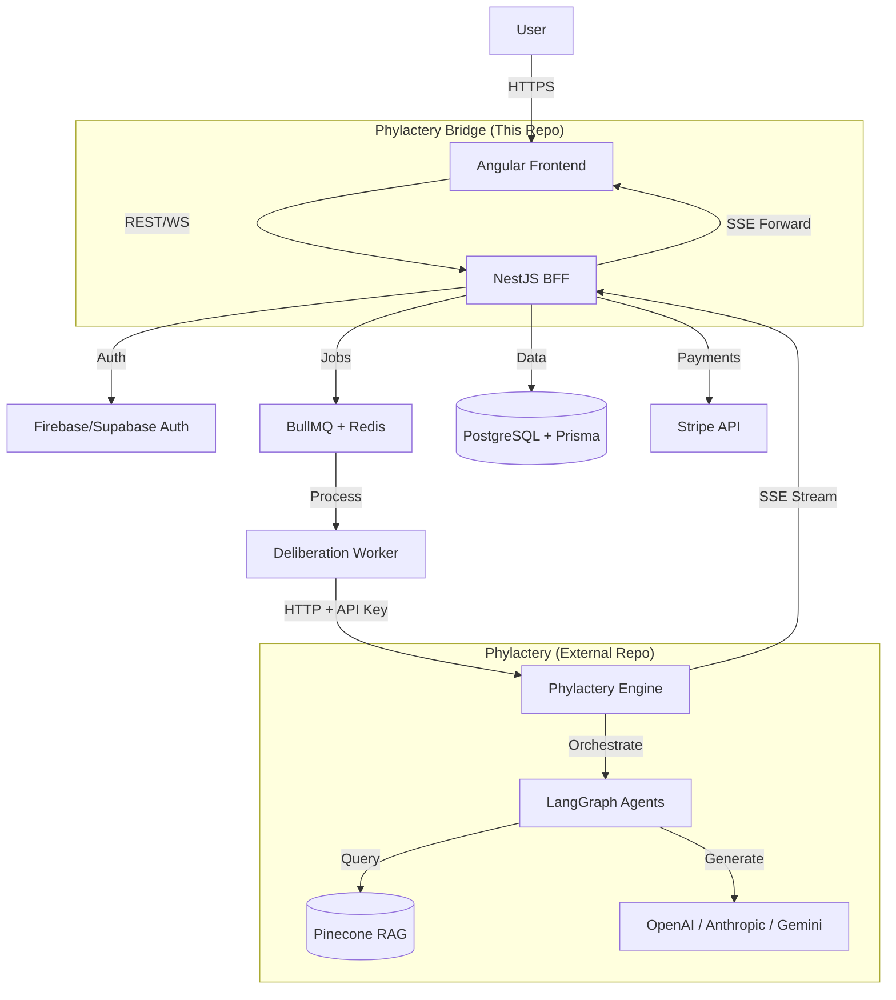
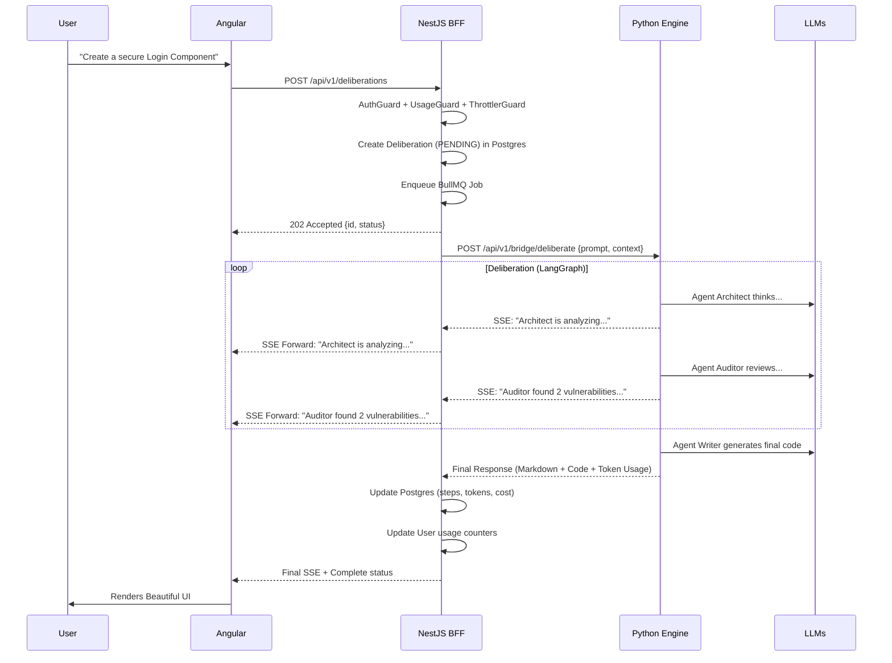

# 🛠️ Phylactery Bridge: Technical Architecture
> **Philosophy:** "Bones (Python Engine) + Spine (Node.js BFF) + Skin (Angular UI)"

## 1. High-Level Architecture

Bridge is a **3-layer Hybrid BFF** application with **2 backends**:

| Layer | Repo | Technology | Responsibility |
| :--- | :--- | :--- | :--- |
| **Skin** (Frontend) | `Phylactery-Bridge` | Angular v19, Signals, TailwindCSS | UX, State Management, Real-time UI |
| **Spine** (BFF) | `Phylactery-Bridge` | NestJS, Prisma, BullMQ, Redis | Auth, Payments, Usage, Rate Limiting, Job Queue |
| **Bones** (Engine) | `phylactery` | Python 3.13, FastAPI, LangGraph, Pinecone | AI Logic, Agent Orchestration, RAG, MCP Tools |

## 2. Integration Protocol

### BFF → Engine Communication
- **Protocol**: REST + SSE (Server-Sent Events) for streaming agent thoughts
- **Auth**: Internal API Key (shared secret between BFF and Engine)
- **Namespace**: Engine exposes `/api/v1/bridge/*` endpoints optimized for BFF calls

## 3. Tech Stack Requirements

### Frontend (This Repo — `/frontend`)
*   **Node:** v20+
*   **Angular CLI:** v19+
*   **State:** Signals (Native) — No NgRx needed for MVP
*   **Styling:** TailwindCSS v4 + DaisyUI (Cyberpunk aesthetic)
*   **Auth:** Firebase Auth (Token sent to BFF for validation)

### BFF (This Repo — `/backend`)
*   **Runtime:** Node.js 20 LTS
*   **Framework:** NestJS (DI, Modules, Guards — "The Angular Way")
*   **Database:** PostgreSQL + Prisma (type-safe, declarative migrations)
*   **Queue:** BullMQ + Redis (resilient async job processing)
*   **Validation:** Zod (runtime LLM output validation)
*   **Auth:** Supabase/Firebase Token Verification

### Engine (Phylactery Repo)
*   **Runtime:** Python 3.13+
*   **Framework:** FastAPI + Uvicorn
*   **AI:** LangGraph (Agent Orchestration)
*   **Memory:** Pinecone (Vector RAG)
*   **Auth:** Internal API Key validation (BFF → Engine)
*   **Endpoints:** `/api/v1/bridge/*` namespace

## 4. Development Workflow
1.  **Run Engine:** `cd ../phylactery && docker-compose up`
2.  **Run BFF:** `cd backend && npm run start:dev`
3.  **Run Frontend:** `cd frontend && ng serve`
4.  **Deploy:**
    *   Engine → Render/Railway (Docker)
    *   BFF → Render/Railway (Node.js)
    *   Frontend → Vercel/Netlify (Static)

## 5. Related Documents

*   [PROJECT_ANALYSIS.md](./PROJECT_ANALYSIS.md) — Strategic analysis and SWOT
*   [PRODUCT_REQUIREMENTS.md](./PRODUCT_REQUIREMENTS.md) — User stories and MVP scope
*   [BUSINESS_PLAN.md](./BUSINESS_PLAN.md) — Monetization and GTM strategy
*   [v0.1 Backend Design](file:///C:/Users/HP/.gemini/antigravity/brain/d9e63c47-3c93-4ae2-8a5b-9ffa90549ccf/phylactery_bridge_v0.1_design.md) — Detailed BFF specification
