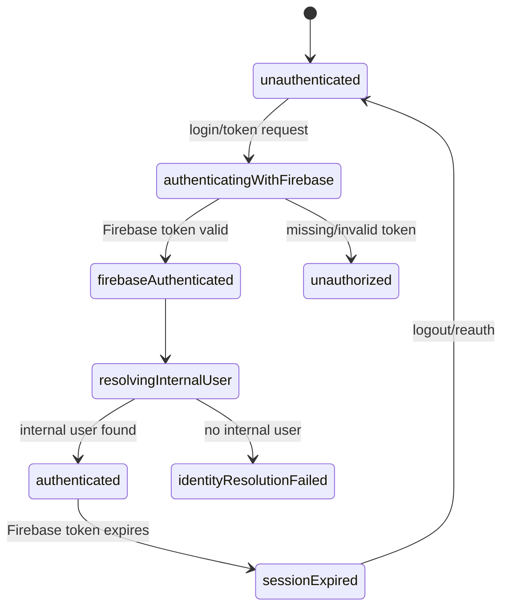
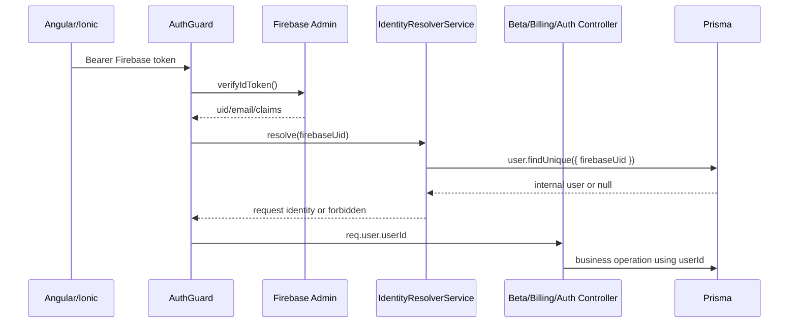

# Design: Hardening Baseline

## Technical Approach

Harden the existing Bun monorepo in place: keep NestJS bootstrap, global validation, Firebase auth, Prisma, Angular/Ionic auth flow, and focused Jest/Karma tests. The main change is to split authentication from business identity: Firebase proves the human subject (`firebaseUid`), then the backend resolves the internal user (`userId`) before protected beta, billing, and profile operations can run.

## Architecture Decisions

| Area | Choice | Alternatives considered | Rationale |
|------|--------|-------------------------|-----------|
| Identity | Add `IdentityResolverService` behind `AuthGuard`; request identity becomes `{ firebaseUid, userId, email?, claims? }`. | Keep `req.user.uid`; resolve per controller; global app state machine. | Removes ambiguous `uid`, centralizes fail-closed behavior, and avoids broad refactor. |
| Failure codes | `401` for missing/invalid/expired Firebase token, `403` for valid Firebase token with no internal user, `403` for insufficient authorization. | `404` for unresolved user; `401` for all auth failures. | Separates authentication from authorization/eligibility while avoiding user enumeration. |
| Docs/CORS | Env-validated origins and docs flag; production docs disabled unless explicitly enabled. | Always-on Swagger; permissive `*` origins. | Matches spec and keeps local dev documented but production explicit. |
| Frontend | Align environment API URL and interceptor failure handling only. | Redesign auth store/router; global state machine. | Keeps scope narrow while making failures predictable. |
| Tests | Focused backend unit/integration/e2e plus minimal frontend boundary tests. | Large full-app suite. | Covers hardening contracts without delaying baseline. |

## Auth / Identity State Machine

Frontend behavior: unauthenticated routes continue redirecting to login/root; `unauthorized` and `sessionExpired` clear local auth expectations and prompt re-login; `identityResolutionFailed` shows a non-destructive account setup/support message and blocks beta/billing side effects; insufficient authorization redirects to beta gate or existing denied flow.

## Data Flow

## Component Boundaries

- `AuthGuard`: parse Bearer token, verify Firebase token, map expired/invalid token to `401`, call resolver, attach normalized request identity, log with request id without secrets.
- `IdentityResolverService`: query internal user by `firebaseUid`, return `userId`, optional `email`, and Firebase claims; fail closed with `403` when no internal user exists. No cross-request cache in this milestone; request-local reuse is acceptable if natural.
- Controllers: beta and billing consume `req.user.userId`; auth profile uses `userId` or `firebaseUid` only through the normalized identity; controllers do not query Firebase identity directly.
- DTOs: beta redeem and billing checkout use explicit DTOs with class-validator decorators; public register keeps explicit `RegisterDto` and validation pipe rejects extra fields.

## File Changes

| File | Action | Description |
|------|--------|-------------|
| `backend/src/main.ts` | Modify | Env-driven CORS and docs gating logs. |
| `backend/src/config/env.schema.ts` | Modify | Add docs flag and production-safe origin validation. |
| `backend/src/core/auth/identity-resolver.service.ts` | Create | Resolve Firebase uid to internal identity. |
| `backend/src/core/auth/interfaces/authenticated-request.interface.ts` | Create | Define normalized request identity shape. |
| `backend/src/core/guards/auth.guard.ts` | Modify | Verify token, resolve identity, set request user. |
| `backend/src/core/auth/auth.module.ts` / `backend/src/core/core.module.ts` | Modify | Provide/export resolver where guard/controllers need it. |
| `backend/src/modules/beta/beta.controller.ts` | Modify | Use DTO and `userId`. |
| `backend/src/modules/billing/stripe.controller.ts` | Modify | Use DTOs and `userId`; keep webhook signature path separate. |
| `backend/src/core/auth/auth.controller.ts` | Modify | Use normalized identity for profile. |
| `frontend/src/environments/environment*.ts` | Modify | Ensure production API defaults are not local/unsafe. |
| `frontend/src/app/core/interceptors/auth.interceptor.ts` | Modify | Token attach and predictable auth failure behavior. |
| `*.spec.ts`, `backend/test/*` | Modify/Create | Focused hardening regression coverage. |

## Testing Strategy

| Layer | What to test | Approach |
|-------|--------------|----------|
| Unit | guard token errors, resolver success/miss, DTO validation | Jest mocks for Firebase/Prisma and validation pipe checks. |
| Integration/e2e | CORS, docs gating, protected beta/billing/profile paths | Supertest with mocked Firebase and Prisma fixtures. |
| Frontend | interceptor attaches token and handles token failure predictably | Karma/Jasmine tests around interceptor/service boundaries. |

## Migration / Rollout

No data migration required. Deploy with explicit env values for allowed origins and docs flag before enabling production. Rollback is one change-set revert: restore prior CORS/docs behavior, `req.user.uid` controller usage, DTO leniency, and frontend interceptor/env behavior.

## Open Questions

- [ ] Confirm final production allowed origins before implementation.
- [ ] Confirm whether unresolved internal users should be directed to registration retry or support in frontend copy.
